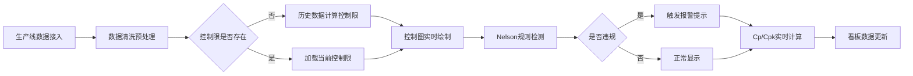

## 1. 产品概述

SPC（统计过程控制）实时看板系统是面向制造业质量管控的生产级数据可视化平台。通过实时采集生产线质量数据，自动绘制控制图、计算过程能力指数、识别异常波动，帮助质量工程师和生产管理人员实时监控过程稳定性，快速识别质量问题，驱动持续改进。

- 核心目标：实现质量数据实时可视化、过程异常自动预警、质量问题根因分析
- 目标用户：质量工程师、生产主管、工艺工程师、工厂管理层
- 核心价值：降低不合格品率、缩短质量异常响应时间、提升过程能力

## 2. 核心特性

### 2.1 用户角色

| 角色 | 使用场景 | 核心需求 |
|------|----------|----------|
| 质量工程师 | 日常质量监控、异常分析、报告生成 | 控制图分析、Nelson规则报警、Cp/Cpk计算、报告导出 |
| 生产主管 | 班组质量管理、机台绩效对比 | 班次/机台对比、帕累托分析、实时报警 |
| 工艺工程师 | 过程改进、参数优化 | 过程能力分析、控制限管理、基线切换 |
| 工厂管理层 | 整体质量概览、绩效看板 | 关键指标汇总、趋势分析、质量报告 |

### 2.2 功能模块

1. **实时监控看板**：关键质量指标概览、实时报警提示、过程能力指数卡片
2. **控制图分析**：Xbar-R控制图、个值移动极差图（I-MR）、Nelson规则违规标记
3. **过程能力分析**：Cp/Cpk/Pp/Ppk实时计算、直方图展示、规格限对比
4. **帕累托分析**：不合格原因频次排行、累计百分比曲线、改善优先级识别
5. **多维度对比**：班次对比、机台对比、批次对比、质量分布差异分析
6. **报告管理**：SPC分析报告生成、PDF导出、历史报告归档
7. **控制限管理**：自动计算控制限、手动调整、基线重算、批次切换

### 2.3 页面详情

| 页面名称 | 模块名称 | 功能描述 |
|----------|----------|----------|
| 实时监控总览 | KPI指标卡 | 展示关键质量指标：合格率、Cp/Cpk均值、报警次数、不合格品数 |
| 实时监控总览 | 实时报警面板 | 滚动展示最新报警信息，按严重程度分级显示 |
| 实时监控总览 | 迷你控制图 | 多指标缩略控制图，快速识别异常指标 |
| 控制图分析 | Xbar-R图 | 均值-极差控制图，含中心线、上下控制限、Nelson违规点标记 |
| 控制图分析 | I-MR图 | 个值移动极差图，适用于单件小批量生产场景 |
| 控制图分析 | Nelson规则面板 | 8条Nelson规则开关控制、违规统计、规则说明 |
| 过程能力分析 | 能力指数卡片 | Cp/Cpk/Pp/Ppk数值展示，低于1.33高亮预警，低于1.0严重警告 |
| 过程能力分析 | 直方图 | 质量特性分布直方图，叠加正态分布曲线、规格限 |
| 帕累托分析 | 帕累托图 | 不合格原因柱状图 + 累计百分比折线图，80/20分界线标记 |
| 帕累托分析 | 原因明细表 | 各类不合格原因的数量、占比、累计占比详细列表 |
| 多维度对比 | 班次对比 | 不同班次质量指标对比雷达图、箱线图分布对比 |
| 多维度对比 | 机台对比 | 不同机台过程能力对比、趋势对比、异常频次对比 |
| 报告管理 | 报告生成 | 自定义报告内容、时间段、指标范围 |
| 报告管理 | 报告导出 | PDF格式导出、历史报告列表、报告预览 |
| 系统设置 | 控制限管理 | 自动计算、手动设置、基线切换、历史版本 |
| 系统设置 | Nelson规则配置 | 规则启用/禁用、参数调整、灵敏度设置 |

## 3. 核心流程

### 3.1 数据采集与监控流程

生产线数据实时接入 → 数据清洗与预处理 → 控制限计算/加载 → 控制图绘制 → Nelson规则检测 → 异常报警 → Cp/Cpk计算 → 看板更新

### 3.2 报告生成流程

用户选择时间段 → 选择分析指标 → 选择报告模板 → 生成分析报告 → 预览报告 → 导出PDF归档

## 4. 用户界面设计

### 4.1 设计风格

- **主色调**：工业蓝（#1E3A5F）作为主色，传达专业、可靠的工业感
- **辅助色**：警示黄（#F59E0B）、报警红（#EF4444）、正常绿（#10B981），用于状态指示
- **背景色**：深灰底色（#0F172A）搭配深色卡片，适合工厂车间长时间监控使用
- **按钮风格**：直角硬朗风格，轻微描边，工业控制面板质感
- **字体**：使用 JetBrains Mono 等宽字体展示数据，确保数字对齐；使用 Noto Sans SC 作为中文主体字体
- **布局风格**：仪表盘式布局，模块化卡片设计，支持自定义拖拽布局
- **图标风格**：线性工业风图标，简洁硬朗

### 4.2 视觉设计要点

- 数据大屏风格，适合车间大屏展示
- 关键数据采用大号数字+变化趋势箭头
- 报警信息采用闪烁动画+醒目颜色
- 控制图支持缩放、平移、数据点悬停详情
- 深色模式为主，减少眼睛疲劳，适合7x24小时监控

### 4.3 页面设计概览

| 页面名称 | 模块名称 | UI元素 |
|----------|----------|--------|
| 实时监控总览 | KPI指标卡 | 大字号数据、趋势箭头、状态色边框、闪烁报警动画 |
| 实时监控总览 | 实时报警面板 | 滚动列表、严重程度色标、时间戳、确认按钮 |
| 控制图分析 | Xbar-R图 | 双图联动、控制限虚线、规格限点划线、违规点高亮标记 |
| 过程能力分析 | 能力指数卡片 | 环形进度条、状态色渐变、阈值线标记 |
| 帕累托分析 | 帕累托图 | 柱状图+折线图双轴、80%参考线、TOP3高亮 |
| 多维度对比 | 对比视图 | 分组柱状图、雷达图、箱线图、颜色编码分组 |

### 4.4 响应式

- 桌面端优先设计，适配1920x1080及以上分辨率
- 支持车间大屏（2K/4K）自适应缩放
- 平板端支持触控操作，按钮尺寸适当放大
- 移动端展示核心KPI和报警信息，简化图表展示

### 4.5 交互动效

- 报警产生时数字脉冲动画
- 数据更新时数字滚动效果
- 控制图数据点悬停显示详细信息
- 面板切换时淡入淡出过渡
- 报警声音提示（可开关）
