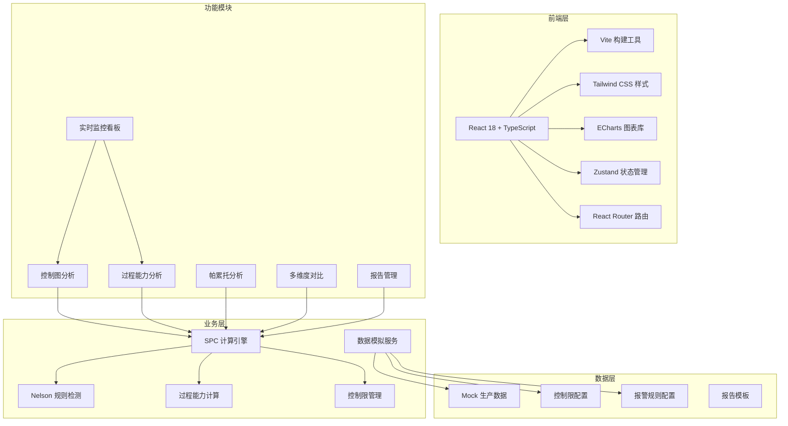

## 1. 架构设计



## 2. 技术选型说明

- **前端框架**：React 18 + TypeScript，提供类型安全和组件化开发
- **构建工具**：Vite 5，快速的开发体验和构建性能
- **样式方案**：Tailwind CSS 3，高效的实用类CSS框架
- **图表库**：ECharts 5，功能强大的可视化图表库，支持复杂控制图绘制
- **状态管理**：Zustand，轻量级状态管理，适合SPC数据状态共享
- **路由**：React Router v6，单页应用路由管理
- **PDF导出**：html2canvas + jsPDF，前端生成PDF报告
- **数据模拟**：自定义Mock数据服务，模拟生产线实时数据

## 3. 路由定义

| 路由 | 页面名称 | 说明 |
|------|----------|------|
| /dashboard | 实时监控总览 | 关键指标概览、实时报警、迷你控制图 |
| /control-charts | 控制图分析 | Xbar-R图、I-MR图、Nelson规则检测 |
| /capability | 过程能力分析 | Cp/Cpk计算、直方图、规格限对比 |
| /pareto | 帕累托分析 | 不合格原因排行、累计百分比曲线 |
| /comparison | 多维度对比 | 班次对比、机台对比、分布差异分析 |
| /reports | 报告管理 | 报告生成、预览、PDF导出、历史归档 |
| /settings | 系统设置 | 控制限管理、Nelson规则配置 |

## 4. 核心数据模型

### 4.1 质量数据点

```typescript
interface QualityDataPoint {
  id: string;
  timestamp: number;
  value: number;
  batchId: string;
  shiftId: string;
  machineId: string;
  operatorId?: string;
  subgroupIndex?: number;
}
```

### 4.2 控制限配置

```typescript
interface ControlLimits {
  id: string;
  metricName: string;
  ucl: number;
  cl: number;
  lcl: number;
  usl?: number;
  lsl?: number;
  target?: number;
  calculatedAt: number;
  baselinePeriod: string;
  isActive: boolean;
}
```

### 4.3 Nelson规则

```typescript
interface NelsonRule {
  id: number;
  name: string;
  description: string;
  enabled: boolean;
  severity: 'warning' | 'critical';
  params?: Record<string, number>;
}
```

### 4.4 报警记录

```typescript
interface AlarmRecord {
  id: string;
  timestamp: number;
  metricName: string;
  ruleId: number;
  ruleName: string;
  severity: 'warning' | 'critical';
  dataPointId: string;
  value: number;
  acknowledged: boolean;
  acknowledgedBy?: string;
  acknowledgedAt?: number;
}
```

### 4.5 过程能力指数

```typescript
interface ProcessCapability {
  cp: number;
  cpk: number;
  pp: number;
  ppk: number;
  mean: number;
  stdDev: number;
  usl?: number;
  lsl?: number;
  sampleSize: number;
  calculatedAt: number;
}
```

### 4.6 不合格原因

```typescript
interface DefectCause {
  id: string;
  name: string;
  category: string;
  count: number;
  percentage: number;
  cumulativePercentage: number;
}
```

## 5. 核心算法模块

### 5.1 SPC计算引擎

- Xbar-R控制图计算：均值、极差、控制限计算
- I-MR控制图计算：单值、移动极差、控制限计算
- 控制限计算公式：UCL/LCL = CL ± 3σ
- 移动极差计算：相邻数据点绝对差值

### 5.2 Nelson规则检测

- 规则1：单点超出3σ控制限
- 规则2：连续9点落在中心线同一侧
- 规则3：连续6点递增或递减
- 规则4：连续14点交替上下波动
- 规则5：连续3点中有2点落在2σ以外（同侧）
- 规则6：连续5点中有4点落在1σ以外（同侧）
- 规则7：连续15点落在1σ以内（两侧）
- 规则8：连续8点落在1σ以外（两侧）

### 5.3 过程能力计算

- Cp = (USL - LSL) / (6σ)
- Cpk = min((USL - μ) / (3σ), (μ - LSL) / (3σ))
- Pp = (USL - LSL) / (6s) （长期）
- Ppk = min((USL - x̄) / (3s), (x̄ - LSL) / (3s)) （长期）

## 6. 目录结构

```
src/
├── assets/          # 静态资源
├── components/      # 通用组件
│   ├── charts/      # 图表组件
│   ├── cards/       # 卡片组件
│   ├── layout/      # 布局组件
│   └── common/      # 通用UI组件
├── pages/           # 页面组件
├── hooks/           # 自定义hooks
├── store/           # 状态管理
├── utils/           # 工具函数
│   ├── spc/         # SPC计算算法
│   ├── nelson/      # Nelson规则检测
│   └── statistics/  # 统计计算
├── mock/            # Mock数据
├── types/           # TypeScript类型定义
├── constants/       # 常量配置
└── styles/          # 全局样式
```

## 7. 性能设计

- 数据更新采用requestAnimationFrame节流
- 图表数据增量更新，避免全量重绘
- 虚拟滚动处理大量数据列表
- 大数据量图表启用ECharts大数据模式
- 历史数据懒加载，按需加载
